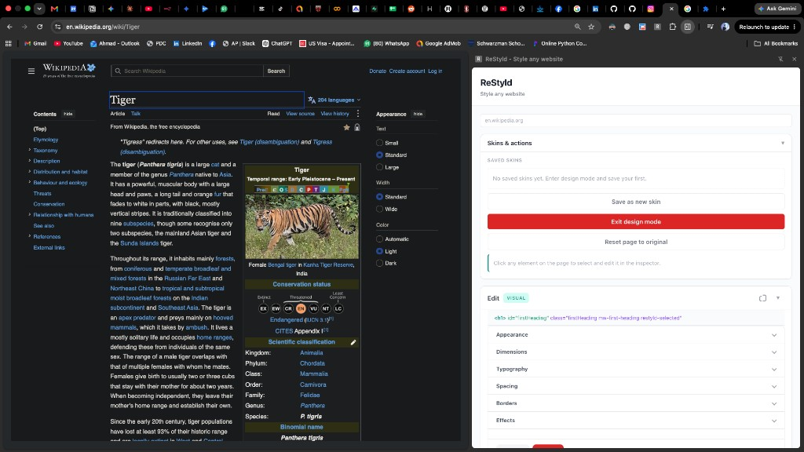
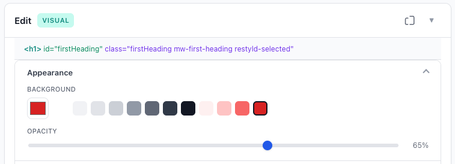
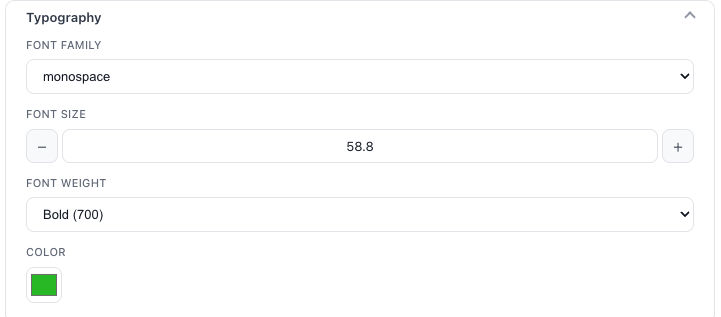
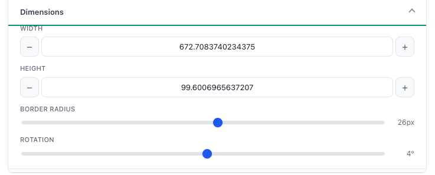
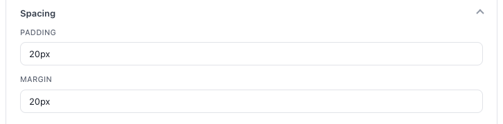
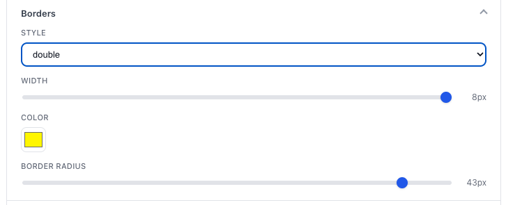
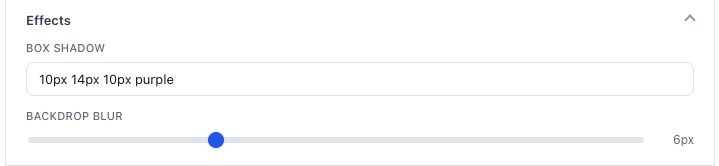
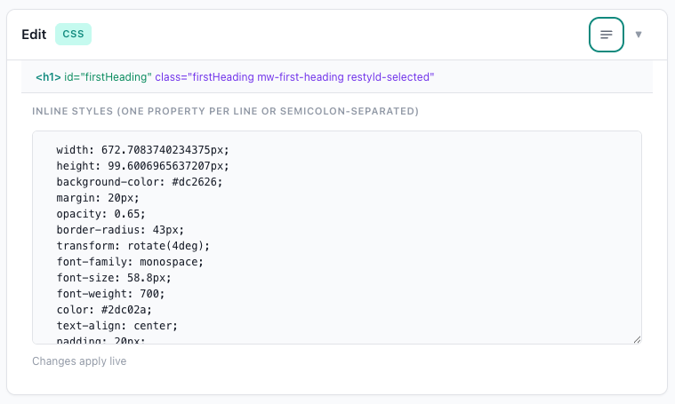
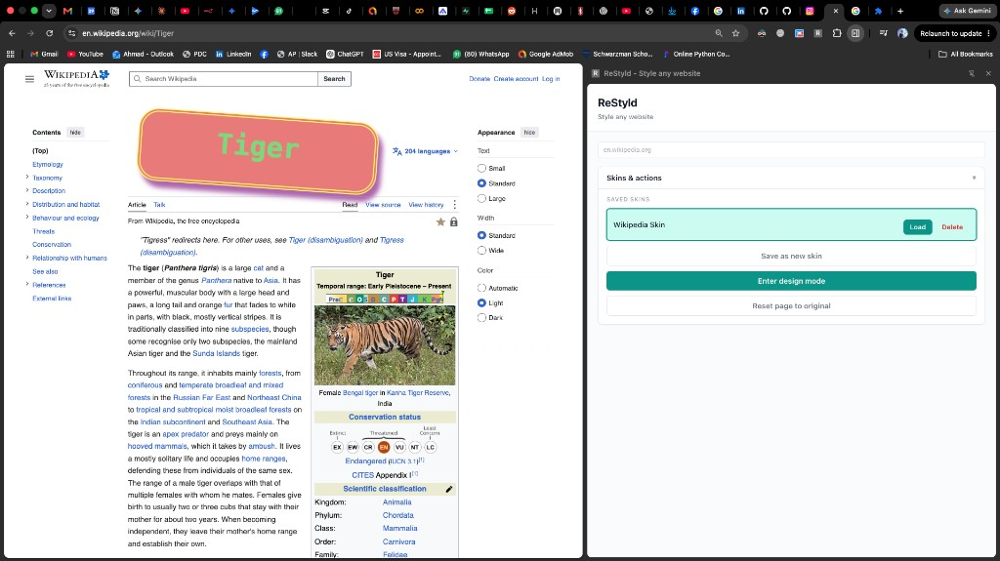

# ReStyld

**Restyle any website like a designer.**

ReStyld is a Chrome extension that lets designers and everyday users redesign their favourite webpages — change colors, typography, spacing, borders, effects, and layout — then save those changes as reusable **skins** that apply again the next time you visit.

---

## Purpose

Most websites are fixed. ReStyld treats the live page as a canvas:

- Click elements to select them
- Edit styles visually (or write CSS by hand)
- Drag, resize, duplicate, or remove elements
- Save your redesign as a skin for that site
- Reload the page later and see your skin applied automatically

It’s built for people who want to customize how the web looks for them — without needing access to the site’s source code.

---

## How it works (overview)

1. You open the **ReStyld side panel** from the Chrome toolbar.
2. You click **Enter design mode** on the current tab.
3. The page enters an editable state: hover highlights elements, click selects them.
4. The side panel’s **Edit** inspector updates for the selected element.
5. You tweak styles (visual controls or raw CSS). Changes apply live on the page.
6. When you’re happy, you **Save as new skin**. Skins are stored per domain (e.g. `en.wikipedia.org`).
7. On later visits, ReStyld can **load** that skin again so your redesign comes back.

Under the hood:

| Piece | Role |
|--------|------|
| **Side panel** (React + Vite) | UI for skins, design mode, and the style inspector |
| **Content script** (`content.js`) | Injected when design mode starts — selection, drag/resize, applying styles |
| **Auto-apply script** (`autoApply.js`) | Runs on page load to re-apply the active saved skin |
| **Background service worker** | Opens the side panel when you click the extension icon |
| **Chrome storage** | Saves skins per host so they persist across sessions |

---

## Getting started

### Load the extension

1. Open `extension-frontend` and run:

   ```bash
   npm install
   npm run build
   ```

2. In Chrome, go to `chrome://extensions`, enable **Developer mode**.
3. Click **Load unpacked** and select the `extension-frontend/build` folder.
4. Pin ReStyld, then open any normal webpage (e.g. Wikipedia).
5. Click the ReStyld icon to open the side panel.

### Enter design mode

In the side panel, click **Enter design mode**. The page becomes editable: hover over elements to see a highlight, then click one to select it. A blue outline marks the selection, and the **Edit** section in the panel shows that element’s tag and classes.



---

## Editing selected elements

Once an element is selected, the **Edit** section offers two modes:

- **VISUAL** — categorized controls (Appearance, Dimensions, Typography, etc.)
- **CSS** — a freeform inline-style editor for power users

### Appearance

Set background color (swatches) and opacity.



### Typography

Adjust font family, font size, font weight, and text color.



### Dimensions

Change width, height, border radius, and rotation. Values update live on the page.



### Spacing

Edit padding and margin with CSS-style values (e.g. `20px`).



### Borders

Choose border style (solid, double, etc.), width, color, and radius.



### Effects

Add box shadows and backdrop blur for depth and glass-like looks.



### Manual CSS editing

Switch to the **CSS** view to edit styles as code — one property per line or semicolon-separated. Changes apply live, so you can refine anything the visual panels don’t cover.



---

## On-page interactions

While design mode is on, you can also work directly on the page:

- **Select** — click an element (only one is selected at a time)
- **Drag / reposition** — move selected elements around the layout
- **Resize** — use resize handles; alignment guides help you line things up
- **Duplicate / remove** — floating controls for the selected element
- **Undo / redo** — keyboard shortcuts to step through recent changes

When you exit design mode (or close the side panel), editing ends and the page returns to normal browsing — but your saved skins remain available.

---

## Skins: save and reuse your redesign

A **skin** is a named set of modifications for a specific domain. After editing, use **Save as new skin**, give it a name (e.g. “Wikipedia Skin”), and it appears under **Saved skins**.

From there you can:

- **Load** — apply that skin to the current page
- **Delete** — remove a skin you no longer want
- **Reset page to original** — clear live edits and restore the page’s default look

Skins are stored in Chrome sync storage, keyed by host, so each site keeps its own collection.



On a later visit, the auto-apply script can re-apply your active skin so the page opens already restyled — without entering design mode again.

---

## Typical workflow

1. Browse to a site you want to customize.
2. Open ReStyld → **Enter design mode**.
3. Click elements and restyle them with the visual inspector (or CSS).
4. Optionally drag, resize, duplicate, or remove elements.
5. **Save as new skin** and name it.
6. Exit design mode and keep browsing — or reload later and **Load** the skin again.

---

## Project layout

```
ReStyld/
├── README.md
├── docs/images/          # Screenshots used in this guide
└── extension-frontend/
    ├── public/
    │   ├── manifest.json
    │   ├── content.js      # Design-mode content script
    │   ├── autoApply.js    # Applies saved skins on load
    │   └── background.js   # Side panel behavior
    ├── src/
    │   ├── App.jsx         # Side panel: skins + design mode
    │   ├── components/     # Sidebar / inspector UI
    │   └── lib/            # Skin storage, style helpers
    └── build/              # Load this folder as an unpacked extension
```

---

## Tech stack

- **Manifest V3** Chrome extension
- **React** + **Vite** for the side panel UI
- **Content scripts** for page selection and live style application
- **`chrome.storage.sync`** for per-host skins
- **`chrome.sidePanel`** for the persistent editor panel

---

## Notes

- Design mode needs a normal webpage (it won’t run on `chrome://` pages or the Chrome Web Store).
- Edits are visual overlays and style changes on the live DOM; they don’t change the website’s server-side code — only how *you* see it in your browser when ReStyld applies a skin.
- Reload the extension from `chrome://extensions` after each `npm run build` when developing.
